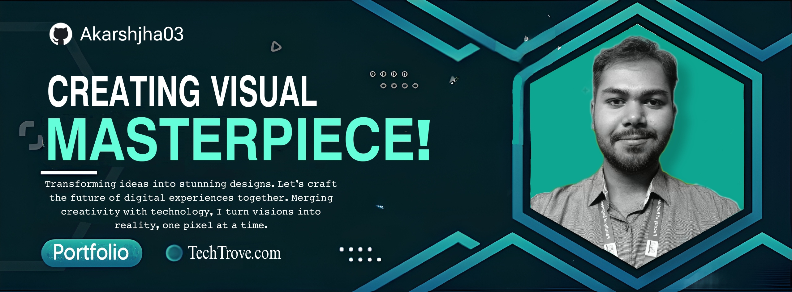

    

 

<table style="border-collapse: collapse;">
  <tr>
    <td style="border: none;">
      
 I'm Akarsh, a passionate Computer Science undergrad specializing in full-stack development focusing on MERN, Android development using React Native, and competitive coding with Java. I enjoy exploring the latest in UI/UX design, AL/ML, and data analytics. My projects reflect my commitment to building impactful, user-centric solutions. I’m always learning and open to new challenges. Let’s collaborate and innovate together!

    </td>
    <td style="border: none;">
      
    </td>
  </tr>
</table>

### Connect With Me 

  
  
  
   

## 🚀 Quick Stats

- 💻 **Tech Stack**: Portfolio includes projects based on MERN stack, React-Native App, Data Science, IOT, and Blockchain.
- 🎨 **UI/UX Enthusiast**: Passionate about design with expertise in Figma integrated with Framer, Adobe XD, and Sketch.
- 📱 **Tech Expoloration**: Exploring GPT models & Graphics design with Adobe Photoshop, and Illustrator with Automating tasks.
- 🎓 **Academic Interests**: Delving into operating systems, microprocessors, system design, and software engineering.
- 📚 **Beyond Coding**: Avid reader, calligraphy artist, chess lover, and active participant in hackathons & weekly challenges.
- 📊 **Projects Completed**: Successfully completed 15+ projects & collaborated with _ companies.
- ✍️ **Blogs Written**: Authored 5+ technical blogs, sharing insights on programming, design, and algorithm optimization. 

<!---
Akarshjha03/Akarshjha03 is a ✨ special ✨ repository because its `README.md` (this file) appears on your GitHub profile.
You can click the Preview link to take a look at your changes.
--->
