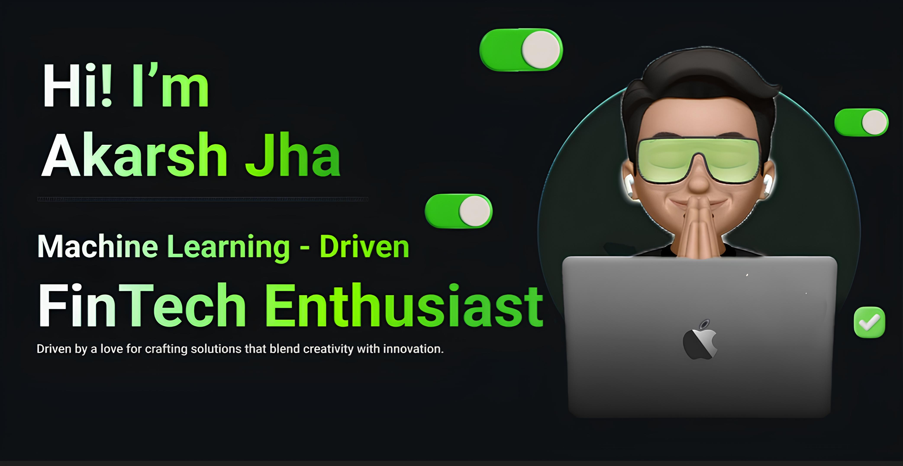

    

 

<table style="border-collapse: collapse;">
  <tr>
    <td style="border: none;">
      
 I'm Akarsh, a passionate Computer Science undergrad specializing in full-stack development focusing on MERN, Android development using React Native, and competitive coding with Java. I enjoy exploring the latest in UI/UX design, trading technology, stock market strategies, high-frequency trading, AI automation, Machine Learning, and data analytics. My projects reflect my commitment to building impactful, user-centric solutions. I’m always learning and open to new challenges. Let’s collaborate and innovate together!

    </td>
    <td style="border: none;">
      
    </td> 
  </tr>
</table>

## 🌍Connect 

  
  
  
   

##  💫Quick Stats

- 💻 **Tech Stack**: Portfolio includes projects based on MERN stack, React-Native App, Data Science, IOT, and Blockchain.
- 🎨 **UI/UX Enthusiast**: Passionate about Product- Driven design with expertise in Figma integrated with Framer, Procreate.
- 📈 Tech Exploration: Diving into trading technology, stock market strategies, and high-frequency trading innovations.
- 🎓 **Academic Interests**: Delving into operating systems, microprocessors, system design, and software engineering.
- 📚 **Beyond Coding**: Avid reader, calligraphy artist, chess lover, and active participant in hackathons & weekly challenges.
- 📊 **Projects Completed**: Successfully completed 15+ projects & collaborated with _ companies.
- ✍️ **Blogs Written**: Authored 5+ technical blogs, sharing insights on programming, design, and algorithm optimization.

  
  
  

  

## 🛠My Skill Set
<table><tr><td valign="top" width="33%">

### Languages

  
<!--  -->

</td><td valign="top" width="33%">

### Frameworks  

<!--  -->

</td><td valign="top" width="33%">

### Tools  

  

</td></tr></table>    

##  📊Profile Stats

  

  

<table align="center">
  <tr>
    <td valign="top">
        
    </td>
    <td valign="top">
        
    </td>
  </tr>
</table>

<h2 align="center"> ⚡ Open Source Achievements 🎖️</h2>

## 🐍Devouring Code, One Contribution at a Time!
<!--- Snake Animation -->

<!---
Akarshjha03/Akarshjha03 is a ✨ special ✨ repository because its `README.md` (this file) appears on your GitHub profile.
You can click the Preview link to take a look at your changes.
--->
